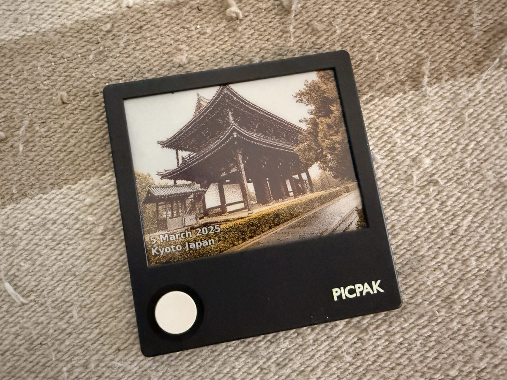
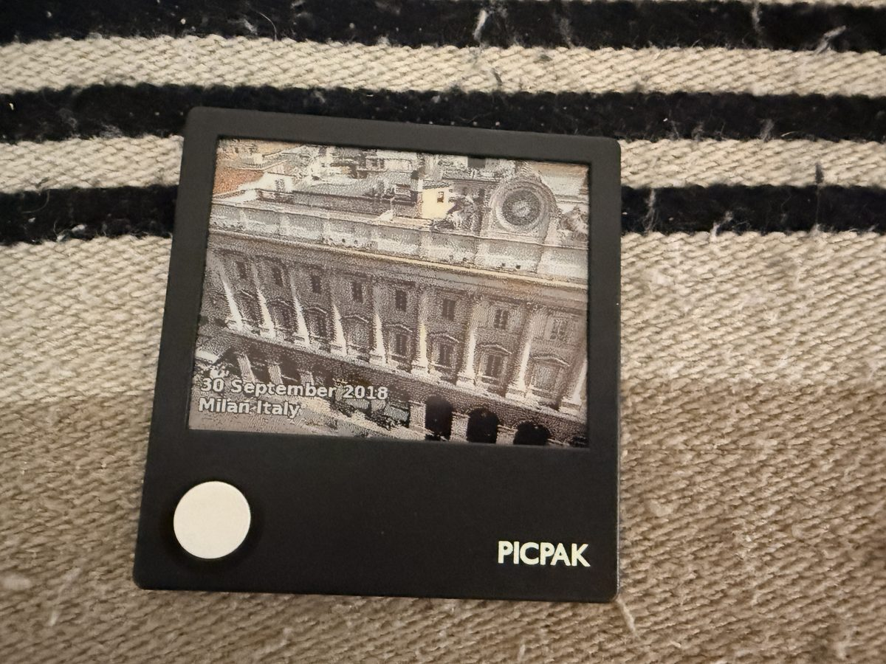
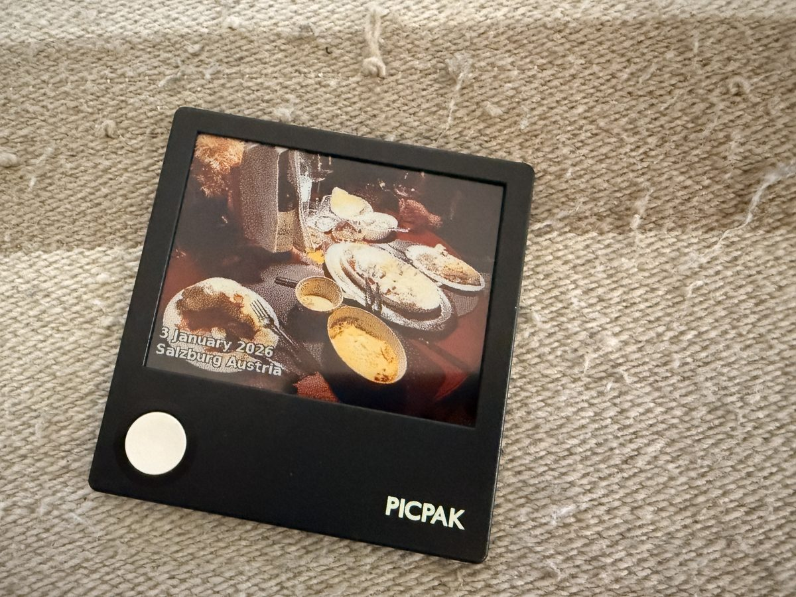
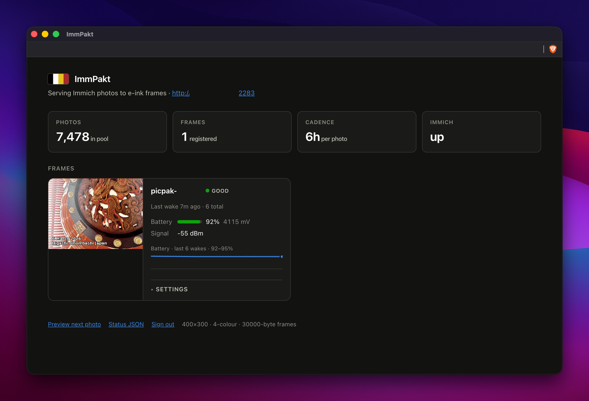

# ImmPakt

Serve photos from [Immich](https://immich.app) to a [PicPak](https://www.picpak.tech)
4.2" four-colour e-ink frame: an ImmichFrame-style setup for a battery-powered
E Ink panel instead of an always-on screen.

 

> Built with help from an AI coding assistant. The rendering, protocol and
> firmware decisions were all reviewed and tested on real hardware, but read the
> code before you trust it with your library, and definitely before you flash
> anything. **Use at your own risk** - see [Disclaimer](#disclaimer).

Two pieces:

1. **This server** (self-hosted, Docker) - talks to Immich, picks the next photo,
   renders it to the panel's native format, serves it. All configuration lives here.
2. **Firmware on the device** - wakes on a timer, does one HTTP GET, paints, sleeps.
   Knows nothing about Immich.

The frame is asleep with its radio off ~99.9% of the time. It wakes on a timer,
makes exactly one HTTP request, paints, and sleeps again. Nothing here depends on
Tesserae, MQTT, or a broker.

## Contents

- [Why the rendering is server-side](#why-the-rendering-is-server-side)
- [Disclaimer](#disclaimer)
- [Quick start](#quick-start)
- [Device protocol](#device-protocol)
- [Frame format](#frame-format)
- [Aspect ratio: crop or mat?](#aspect-ratio-crop-or-mat)
- [Tuning the look](#tuning-the-look)
- [Photo selection](#photo-selection)
- [Dashboard](#dashboard)
  - [Settings are queued, not pushed](#settings-are-queued-not-pushed)
- [Battery](#battery)
- [Firmware](#firmware)
  - [Flashing a release (what most people want)](#flashing-a-release-what-most-people-want)
  - [Building it yourself](#building-it-yourself)
  - [First boot](#first-boot)
  - [Previewing the setup portal without flashing](#previewing-the-setup-portal-without-flashing)
- [Volume permissions](#volume-permissions)
- [Security](#security)
- [Releases](#releases)
- [Development](#development)

## Why the rendering is server-side

The panel wants 400×300 pixels quantised to exactly four colours - black, white,
yellow, red, and nothing else. Immich hands you a JPEG of arbitrary size.

Converting between them means decode → orient → fit → tone-shape →
error-diffusion dither. The ESP32-C3 in the frame has ~400 KB of SRAM and no
PSRAM, where a single 400×300 RGB888 buffer alone is 360 KB, before WiFi and
TLS. So the device never sees a JPEG. It receives 30000 bytes of packed palette
indices and paints them.

The other reason is iteration speed: dither quality *is* the result on a
four-colour panel, and tuning it against `/preview.png` in a browser takes
seconds. Tuning it in firmware takes a reflash.



Dark, low-contrast source material is the hard case: there is no grey, so
midtones become dithered black-and-white with red and yellow doing what chroma
they can. `frame.enhance` and `frame.palette` are the dials that matter; see
[Tuning the look](#tuning-the-look).

## Disclaimer

**Use at your own risk.** This is a personal project, not a product.

- **Not affiliated** with, endorsed by, or supported by AUTOHEART / PicPak, or by
  Immich. "PicPak" is their name for their hardware; this project just talks to it.
- **Flashing replaces the stock firmware.** Without the verified dump that
  `backup-stock.sh` produces there is no way back, and it may void your warranty.
  Read [Firmware](#firmware) before you plug anything in.
- **It is real hardware.** An interrupted write, a marginal USB cable or a flat
  cell can leave a frame that does not boot. This board is brownout-prone enough
  that the upstream firmware caps radio TX power to work around it.
- **Defaults are tuned for a trusted LAN.** The dashboard ships with a known
  password and the device endpoint has no authentication at all. Read
  [Security](#security) before exposing it to anything wider.
- **No warranty of any kind**, express or implied, per AGPL-3.0 sections 15 and 16.

Nothing here reads or writes your Immich library beyond fetching thumbnails: the
API key needs read access only, and no endpoint in this project deletes or
modifies an asset.

## Quick start

```bash
cp config.example.yaml config/config.yaml   # edit immich.url and your album ids
docker compose up -d
```

That pulls the published image. Two things are overridable from a `.env` beside
the compose file:

```ini
IMMPAKT_IMAGE=youruser/immpakt:latest   # if you publish your own build
IMMPAKT_HTTP_PORT=9000                  # host port; the container stays on 8080
```

Then open <http://localhost:8080> for the dashboard, or
<http://localhost:8080/preview.png?next=true> to page through exactly what the
panel will paint.

The API key can live in `config/config.yaml` or in the environment. **Anything
set as an environment variable overrides the file**, so if you put `IMMICH_URL`
in `docker-compose.yaml` *and* in the config file, editing the file will appear to
do nothing.

Without Docker:

```bash
python -m venv .venv && .venv/bin/pip install -e ".[dev]"
IMMICH_URL=http://immich:2283 IMMICH_API_KEY=... .venv/bin/python -m immpakt serve
```

Check the whole chain - connection, auth, filters, pool - in one go:

```bash
.venv/bin/python -m immpakt doctor    # or: docker exec immpakt immpakt doctor
.venv/bin/python -m immpakt albums    # list album UUIDs for config.yaml
```

## Device protocol

One request per wake. Telemetry rides up in the query string, the sleep interval
rides down in a response header, so the firmware needs **no JSON parser** on the
wake path.

```http
GET /api/frame.bin?id=picpak-a1b2c3&mv=4164&pct=96&rssi=-63&wake=timer
If-None-Match: "062d1c27761325ee"
```

| Response | Meaning |
| --- | --- |
| `200` + `ETag` + `X-Next-Wake: <s>` + 30000 bytes | paint this, then sleep `X-Next-Wake` seconds |
| `304` + `X-Next-Wake: <s>` | nothing new; skip the 13–22 s repaint and sleep |
| `503` | server or Immich unhappy; keep the current image, retry next wake |

Devices **self-register on first contact** - no pairing, no tokens. Set
`server.device_key` if you expose this beyond your LAN, and devices must then
send `&key=<secret>`.

## Frame format

Raw, headerless, exactly **30000 bytes** (`400 × 300 ÷ 4`):

- 2 bits per pixel, 4 pixels per byte, **MSB-first** (leftmost pixel in bits 7:6)
- palette indices `0`=Black `1`=White `2`=Yellow `3`=Red
- rows packed **bottom-to-top** - the panel scans that way

All three are enforced by tests in `tests/test_render.py`.

## Aspect ratio: crop or mat?

The panel is exactly 4:3, so this is the decision that most affects how your
photos look. `frame.fit.mode` picks the policy:

| Mode | Behaviour |
| --- | --- |
| **`cover`** (default) | Every photo fills all 400×300, cropped as much as it takes. Panoramas and portraits alike. Bars never appear. |
| `auto` | Crop up to the tolerances below, mat anything beyond them. |
| `contain` | Never crop; fit the whole photo and mat the remainder. |

Under `cover`, **`fit.face_aware` is the setting that matters**: a 9:16
portrait keeps only ~42% of its height, so the crop window either lands on your
subject or decapitates them. It biases the window toward the faces Immich has
already detected, with a little headroom. Leave it on.

If you ever want mats back, `auto` takes two tolerances: the largest aspect
*mismatch factor* still solved by cropping, asymmetric on purpose because
losing the sides of a wide photo costs less than losing the top and bottom of a
tall one:

| Source | Mismatch | Knob | Result under `auto` |
| --- | --- | --- | --- |
| 4:3 | 1.00× | - | cover, nothing lost |
| 3:2 | 1.13× | `crop_tolerance_wide` | cover |
| 16:9 | 1.33× | `crop_tolerance_wide` | cover, ~25% off the sides |
| 3:1 panorama | 2.25× | `crop_tolerance_wide` | cover |
| 3:4 portrait | 1.78× | `crop_tolerance_tall` | mat |
| 9:16 portrait | 2.37× | `crop_tolerance_tall` | mat |

Defaults are `crop_tolerance_wide: 8.0` and `crop_tolerance_tall: 1.40`. To drop
portraits from the rotation entirely instead, set `source.min_aspect: 1.0`.

## Tuning the look

A four-colour panel has only red and yellow as chroma, so untouched photos
dither toward flat grey. Two things matter most:

- **`frame.enhance.saturation`** (default 1.45) is what makes the panel actually
  use its colours. **`contrast`** (1.10) and **`autocontrast`** do the rest.
- **`frame.palette`** - the RGB the dither *aims at* for each panel colour. The
  defaults are a reasonable BWYR approximation, but a real panel's red is a dark
  brick and its yellow is mustard. Photograph a test frame, sample the four
  patches, and put those values here; it improves results more than any other knob.

Iterate against `/preview.png` with no hardware attached. To check a single local
file:

```bash
.venv/bin/python -m immpakt render photo.jpg -o preview.png --bin frame.bin
```

## Photo selection

`source.albums` is the usual way to curate a frame; leave everything empty for
the whole library. Each device walks its own deterministically-shuffled
permutation of the pool, so it sees **every eligible photo once before
repeating**, reshuffles on the next pass, and two frames in the same house show
different photos.

This deliberately does **not** use Immich's `/search/random`, which has a history
of regressions (same asset every call in 1.125.x, 404 in 2.1.0) and results
biased toward low UUIDs. The pool is fetched on a timer (`refresh_interval_s`),
never on the device request path, and a failed refresh keeps the last good pool
rather than blanking the frame.

## Dashboard



Everything is on one page. Four tiles across the top answer the questions you
actually open it for: how many photos are eligible, how many frames are
registered, how often they change, and whether Immich is reachable.

Below that, a card per frame showing:

- **the photo currently on that panel**, rendered exactly as the device has it
- **battery** as a percentage, raw millivolts, and a sparkline of the last wakes
- **signal strength** and how long ago it last checked in
- **what is queued next**, with a Skip button if you do not like it

The battery sparkline plots on a fixed 0-100% scale rather than auto-scaling to
its own range, so a healthy 92-95% reads as a flat line near the top instead of
a dramatic-looking cliff.

Sign-in is required (see [Security](#security)); the frame's own endpoint is not
behind it, because a device asleep with its radio off cannot log in.

### Settings are queued, not pushed

That radio being off most of the time is the whole design, so there is no way to
push a change to a frame. Edits are stored and collected on the device's next
wake, and the panel says when that will be ("applies in ~5h, or tap the frame's
button now") instead of pretending it took effect.

Cadence and the caption overlay are editable per device. They live in SQLite,
deliberately not written back into your hand-commented `config.yaml` - a web UI
rewriting that file would destroy the comments and race with anyone editing it
by hand. Layering is file, then `devices.<id>`, then dashboard edits, so what
you set in the browser wins.

## Battery

The panel refresh is the dominant power cost, so `frame.interval_s` is
simultaneously "how often the photo changes" and "how long the battery lasts".
The default 21600 (6 h) gives four photos a day. The dashboard plots the battery
telemetry each device reports on every wake.

## Firmware

Lives in [`firmware/`](firmware/) - a fork of
[varanu5/picpak-tesserae-client](https://github.com/varanu5/picpak-tesserae-client)
(AGPL-3.0), which supplies the hard-won parts: the UC81xx panel driver with its
`0xA5` deep-sleep check-code, the brownout mitigations this board needs (TX power
capped to 10 dBm, radio off before painting), the low-battery FSM, WiFi
fast-connect, and captive-portal provisioning.

Removed: `rest_handler.c`, `mqtt_handler.c`, `heartbeat.c`, `image_fetcher.c`:
the entire Tesserae transport. Added: `frame_client.c`, one HTTP GET per wake.
No JSON parser, no pairing handshake, no broker.

> **Before flashing anything**, back up the stock firmware. Replacing it is not
> reversible without a verified dump, and `flash.sh` refuses to run until one
> exists. `backup-stock.sh` dumps the flash twice and fails unless both dumps
> are byte-identical, because a single dump can be silently corrupted by a
> flaky cable and you would not find out until you needed it.

### Flashing a release (what most people want)

Grab `immpakt-merged.bin` from the
[latest release](https://github.com/avatar-miro/immpakt/releases/latest), check
it against `SHA256SUMS`, and flash it. No toolchain, no build.

```bash
pip install esptool                       # if you do not have it
./firmware/backup-stock.sh                # do this first, it is the only way back

esptool.py --chip esp32c3 --port /dev/cu.usbmodemXXXX \
  write_flash 0x0 immpakt-merged.bin
```

The merged image contains the bootloader, partition table and app at their
correct offsets. The three parts are published separately too, if you would
rather flash them individually.

### Building it yourself

Only needed if you are changing the firmware. Nothing is installed on the host:
the build runs in Espressif's own container.

```bash
cd firmware
./backup-stock.sh     # device plugged in over USB; ~2 x 16 MB, a few minutes
./build.sh            # builds in the espressif/idf:release-v5.3 container
./flash.sh            # flashes from the host (Docker/macOS has no USB passthrough)
```

CI builds with the same image and tag, so a release artifact and a local build
of the same commit are the same binary.

### First boot

First boot opens the setup portal: join Wi-Fi **ImmPakt-Setup** (password
`immpakt123`), open <http://192.168.4.1>, and set the server URL to this
server, e.g. `http://192.168.1.10:8080`. The portal's optional code field maps to
`server.device_key`. Leave the transport on REST and ignore the MQTT fields;
they are inert leftovers from the upstream portal UI.

The wire contract between the two halves is pinned by `tests/test_device_contract.py`,
which reads the request format straight out of `firmware/main/frame_client.c`, so
changing one side without the other fails a test rather than a photo frame.

**Licensing:** the firmware is AGPL-3.0 by descent. The server talks to it only
over HTTP and is a separate program, but if you redistribute the firmware the
AGPL applies to it.

### Previewing the setup portal without flashing

The captive portal's HTML lives as C string literals in `provisioning.c`. To see
it without re-provisioning a device:

```bash
firmware/tools/portal_preview.py --serve      # http://127.0.0.1:877
```

It parses the real literals out of the source and reassembles the page the same
way `setup_get_handler()` does, re-reading on every request, so edit, refresh,
repeat. `--error "..."` previews the failure banner, `--page thanks` the
post-submit page, `--blank` a factory-fresh device.

## Volume permissions

Works on a fresh host with nothing prepared. `./data` and `./config` are bind
mounts carrying the **host's** ownership, not the image's, so startup uses root
only to chown them to `PUID:PGID`, then drops privileges with `setpriv`. The
process serving traffic is never root. This is the same pattern most
self-hosted images use, and it is why they need no host preparation.

Point it at your own user and `./data` stays readable outside the container:

```ini
# .env beside docker-compose.yaml
PUID=1000
PGID=1000
```

If you would rather root were never involved at all, set an explicit user and
own the directories yourself:

```yaml
user: "1000:1000"
```
```bash
mkdir -p data config && sudo chown -R 1000:1000 data config
```

The entrypoint detects that case and only verifies, since it cannot repair
anything. It probes by actually writing a file rather than testing permission
bits, because `[ -w ]` reflects what the kernel thinks and some volume drivers
misreport it. On failure it names the uid, the directory's owner and the exact
command to run, instead of a sqlite traceback.

## Security

Designed for a **trusted LAN**. Before exposing it wider, know what it does and
does not do.

What is enforced:

- **Device ids are validated** (`[A-Za-z0-9][A-Za-z0-9._-]{0,63}`) before
  becoming a database row or reaching the dashboard.
- **Dashboard-settable fields are whitelisted and range-checked** - a POST
  trying to set `palette`, `dither` or `rotate` is rejected, so a bad request
  cannot corrupt rendering.
- **Settings require `Content-Type: application/json`.** `text/plain` is a CORS
  "simple request" that skips preflight, so without this a page you merely
  visited could reconfigure your frame cross-origin.
- **`server.device_key` is compared with `hmac.compare_digest`**, not `==`.
- **The container runs as uid 10001**, not root.
- All SQL is parameterised; all interpolated HTML is escaped.

What is **not**, and is your decision to accept:

- **The dashboard and management API have no authentication.** Anyone who can
  reach port 8080 can change settings, skip photos, or delete a device.
  `server.device_key` gates only `/api/frame.bin`; it protects the photo feed,
  not the controls. Put it behind a reverse proxy with auth if that matters.
- **`device_key` travels in the query string**, so it lands in access logs and
  any proxy in between. It is a weak shared secret, not a credential.
- **Any reachable client can register a device** by inventing an id, which
  creates a row and costs a render. There is no rate limiting.
- **Your Immich API key sits in `config/config.yaml` in plaintext.** That file is
  gitignored; keep it that way, and prefer `IMMICH_API_KEY` in the environment if
  the host is shared.
- The frame talks **plain HTTP** on the LAN. The firmware validates HTTPS against
  ESP-IDF's built-in CA bundle, so a self-signed certificate will not work.

## Releases

Pushing a `v*` tag runs both release workflows:

- **Firmware**: built in `espressif/idf:release-v5.3`, published to a GitHub
  Release as `immpakt.bin` + bootloader + partition table, plus a single
  `immpakt-merged.bin` for one-command or browser flashing, with `SHA256SUMS`.
- **Docker**: `youruser/immpakt:1.2.3`, `:1.2` and `:latest`, for amd64 and
  arm64. `latest` uses `latest=auto`, so a prerelease tag like `v1.0.0-rc1`
  publishes itself without hijacking `latest`.

Any other push to `main` publishes **`:snapshot`** only, so `latest` never
silently moves to an untagged commit. Pull requests build both but push neither.

Needs two repository secrets: `DOCKERHUB_USER` and `DOCKERHUB_PAT`.

## Development

```bash
.venv/bin/python -m pytest -q     # 102 tests, no hardware or Immich needed
```

Coverage is deliberately weighted to the things that fail silently rather than
loudly:

| Area | What it pins |
| --- | --- |
| `test_render.py` | byte order, MSB packing, the bottom-to-top row flip, fit policy at every aspect |
| `test_overlay.py` | caption layout, margins, shrink-to-fit, EXIF orientation |
| `test_device_contract.py` | the request format parsed out of the real `frame_client.c` |
| `test_app.py` / `test_settings.py` | the full device protocol against a stubbed Immich |
| `test_security.py` | one test per finding in the Security section |
| `test_immich.py` | both album response shapes, across Immich versions |
